  

 

  
  &nbsp;&nbsp;
  

  
    generated from <a href="./profile/profile.json"><code>profile.json</code></a>
    → <a href="./scripts/generate-profile.mjs"><code>renderer</code></a>
    → <code>SVG</code>
  

