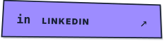

  

 

  
  &nbsp;&nbsp;
  

  
    <a href="./profile/profile.json"><code>source</code></a>
    → <a href="./scripts/generate-sketchbook.mjs"><code>zero-dependency renderer</code></a>
    → deterministic imperfections
  

